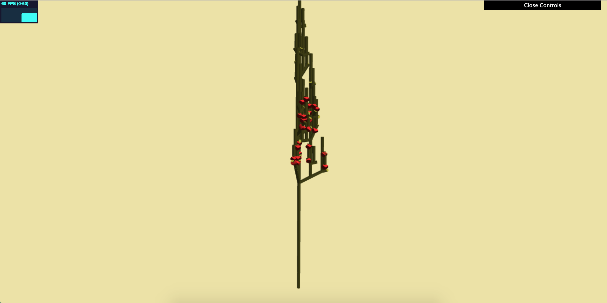

## Amy Chen // amyjchen

## Demo Link: https://merunicorn.github.io/hw04-l-systems/

[]

## Created multiple classes to simulate L-Systems
## LSystem class:
- takes in the Axiom, an alphabet, and number of iterations to set up the whole l-system. Fills two maps, which map a string to an ExpansionRule and DrawingRule respectively.
- Sets up the maps, parses through the Axiom (referring to the expansion map to expand the axiom over the given number of iterations), and then executes the Axiom (calling DrawingRule on each character), and setting up turtles as needed.
- Also keeps track of a stack of Turtles, and pushes/pops based on the [ and ] characters.
- Sets up transformation matrices for turtles, and will ultimately create arrays of vec4s to be passed into the Mesh VBOs in main.
## Turtle class:
- Representing a turtle/save state in the l-system, it keeps track of a position, orientation (quaternion), color (unused), and recursion depth.
- Updates position based on translation from Drawing Rules, and will move along its orientation "forward".
- Updates rotation based on rotation from Drawing Rules, and will rotate on its orientation (I had trouble getting this to work properly).
## DrawingRule class:
- Keeps track of any variables that would be affected by any rules (translation, rotation, scale, etc.)
- Scales depending on number of iterations and recursion depth
- Calls different functions depending on the symbol/letter passed in.
## ExpansionRule class:
- Simply expands the input symbol into some longer string. I determined what to expand to by playing around with the provided site here: http://www.kevs3d.co.uk/dev/lsystems/

## Set up Instanced Rendering VBOs for the Mesh class
## Edits to Mesh class, ShaderProgram class, Drawable class, and instanced-vert.glsl
- Similar to how instanced rendering was set up in the Square class in the provided base code, I set up a class setVBOTransform that took in my colors array and four transformation arrays (each representing a different column of a transformation matrix) and set up the buffers, which I set up in ShaderProgram and Drawable.
- Set up buffers for Transform1 through Transform4, where each buffer is a vec4 column in the desired transformation matrix.
- I then passed this into the shader and built it back into a transformation matrix form so I could transform the position there, thus achieving instanced rendering/different transformations for each instance of the same mesh.

## Scene Attributes
## Plant characteristics
- Because I had trouble with getting the rotation in my L-System to work properly, I wasn't able to achieve exactly my desired plant look here. However, I worked with what I have to make a cactus-like plant.
- Created a basic octagonal prism stem obj file using Maya, as well as a "bud" obj file by adding edge loops to a cube and making a diamond like shape in Maya.
- Adjusted the rotation angles with randomness factors so that the plant would draw in 3D and appear slightly more naturalistic.
- Drew the buds only past a certain recursion depth (>= 3 where the initial depth is 0), and added a randomness factor, so that the buds only drew around 30% of the time.
- Set up color arrays individually for the bud and the stem parts, so I could color the bud red and the stem/cactus green.
- Added lambertian shading with a yellow-tinted light in the fragment shader.
- Set the background color to be a dull yellow shade, to mimic a desert backdrop.

## Resources
- http://glmatrix.net/docs/module-quat.html - referred to when working with quats/vec/mat functions
- http://www.kevs3d.co.uk/dev/lsystems/ - to try out different l-systems and find rules/a result that I liked

